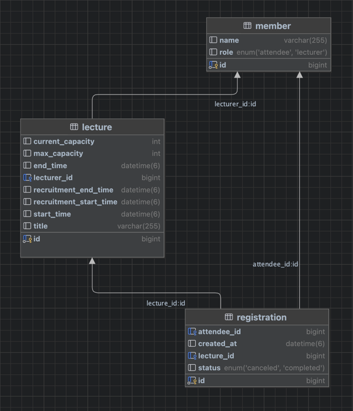

### Index
- [특강 신청 시스템](#특강-신청-시스템)
  - [ERD](#erd)
    - [요구사항 분석](#요구사항-분석)
       - [특강 조회 API](#특강-조회-api)
       - [신청 목록 API](#신청-목록-api)
       - [특강 신청 API](#특강-신청-api)
    - [테이블](#테이블)
       - [Lecture](#lecture)
       - [Registration](#registration)
       - [Member](#member)
- [Study](#study)
  - [트랜잭션 격리 수준](#트랜잭션-격리-수준)
     - [READ UNCOMMITTED](#read-uncommitted)
     - [READ COMMITTED](#read-committed)
     - [REPEATABLE READ](#repeatable-read-mysql-default)
     - [SERIALIZABLE](#serializable)
  - [JPA Lock](#jpa-lock)
     - [낙관적 락](#낙관적-락optimistic-lock)
     - [비관적 락](#비관적-락pessimistic-lock)
     - [낙관적 락 vs 비관적 락](#낙관적-락-vs-비관적-락)
  - [회고](#회고)

# 특강 신청 시스템

## ERD


### 요구사항 분석

1. **특강 조회 API**
    - 특정 시간을 기준으로 모집 중인 특강을 조회합니다.
    - 모집 중인 특강은?
        - 특정 시간 기준 모집 기간 내에 있는 특강입니다. (현재는 모집 중이 아닐 수 있습니다.)
        - 정원이 모두 찬 경우에도 수강 취소 인원이 생길 가능성을 대비해 함께 조회 합니다.
2. **신청 목록 API**
    - 특정 유저의 신청 목록 중 현재 시간을 기준으로 강의가 시작되지 않은 특강은 조회 합니다.
    - 현재 상태가 신청 완료인 특강만 조회 합니다. (취소는 조회하지 않습니다.)
3. **특강 신청 API**
    - 현재 모집 중인 특강만 신청이 가능합니다.
    - 현재 수강 신청 인원이 정원에 미달한 경우에만 신청이 가능합니다.
    - 동일한 사용자는 동일한 특강을 중복 신청할 수 없습니다.
    - 강의 취소 후 재신청이 가능합니다.

### 테이블

`Lecture`

| column | description                                                                                      |
|--------|--------------------------------------------------------------------------------------------------|
|`recruitment_start_time` `recruitment_end_time` | 모집 기간을 나타내기 위한 컬럼입니다.                                                                            |
| `start_time` `end_time` | 강의 시간 정보를 나타내기 위한 컬럼입니다.                                                                         |
| `max_capacity` `current_capacity` | 수강 인원 정보를 나타내기 위한 컬럼입니다. |

**`current_capacity` 을 `Lecture` 테이블에 둔 이유**
- `Registration` 조인 없이 현재 신청 인원을 얻기 위한 목적

`Registration`

| column                      | description              |
|-----------------------------|--------------------------|
| `attendee_id`               | 모집 신청한 참석자를 나타내기 위한 컬럼입니다. |
| `lecture_id`                | 신청한 강의를 나타내기 위한 컬럼입니다.   |
| `status` | 신청 완료, 신청 취소 상태를 나타냅니다.  |

`Member`

| column | description              |
|--------|--------------------------|
| `role` | 강연자와 참석자를 구분하기 위한 컬럼입니다. |

# Study

## 트랜잭션 격리 수준

### READ UNCOMMITTED

**Description**
- 커밋되지 않은 데이터를 읽을 수 있음

**Problem**
- Dirty Read: 한 트랜잭션에서 커밋되지 않은 데이터를 다른 트랜잭션이 읽을 수 있는 현상

### READ COMMITTED

**Description**
- 커밋된 데이터만 읽을 수 있음
- Dirty Read 방지 가능

**Problem**
- Non-Repeatable Read: 같은 트랜잭션 내에서 같은 데이터를 여러 번 읽을 때, 상이한 값이 조회되는 현상
- Phantom Read: 같은 조건으로 조회했을 때, 이전에는 없던 데이터가 생기는 현상

### REPEATABLE READ (MySQL default)

**Description**
- 변경 전 레코드를 UNDO 영역에 백업 - 여러 버전의 데이터가 존재하는 MVCC(Multi-Version Concurrency Control)
- 순차적으로 증가하는 트랜잭션 ID와 레코드를 함께 보관
- UNDO 영역에서 현재 트랜잭션 이전의 트랜잭션 ID를 가진 레코드만 읽어오게 되므로 Non-Repeatable Read 방지 가능
- 일반적인 조회의 경우, 동일한 매커니즘으로 Phantom Read 또한 방지 가능

**Problem**
- `SELECT FOR UPDATE` 와 같이 락을 사용하는 조회의 경우 UNDO 영역이 아닌 테이블에서 수행되므로 Phantom Read는 방지할 수 없다
  - 왜 테이블 영역에서 수행?
    - `SELECT FOR UPDATE`는 데이터를 읽으면서 동시에 다른 트랜잭션이 해당 데이터를 수정하지 못하도록 잠근다
    - 왜? 일반적으로는 읽은 후 내가 수정하려고
    - 따라서 최신 데이터를 봐야할 필요가 있다 = 테이블을 봐야 한다
- MySQL의 경우에는 넥스트 키 락(Next-Key Lock) 방식을 사용하기 떄문에 어느 정도 Phantom Read 방지 가능하다
  - 넥스트 키 락(Next-Key Lock)?
    - 레코드 락(Record Lock) + 갭 락(Gap Lock)
      - 레코드 락: 실제 레코드에 대한 락
      - 갭 락: 레코드 사이 간격에 대한 락
       ```sql
         -- 트랜잭션 A
         START TRANSACTION;
         SELECT * FROM lecture WHERE lecture_id BETWEEN 10 AND 20 FOR UPDATE;
      
         -- 트랜잭션 B
         INSERT INTO lecture VALUES (15, ...); -- 블로킹
       ```
  - 락으로 조회한 구간에 대해서는 `INSERT`가 불가하기 때문에 어느정도 Phantom Read 방지 된다
  - 단, 일반적인 조회(from UNDO) 후 락을 포함한 조회(from Table)를 실행하는 경우에는 두 조회가 참조하는 시점이 다르기 때문에 Phantom Read가 발생할 수 있다 

### SERIALIZABLE

**Description**
- 가장 높은 격리 수준
- `SELECT` 쿼리가 내부적으로 `SELECT FOR SHARE` 처럼 동작

**Problem**
- 공유 락으로 설정되어 있는 경우, 타 트랜잭션에서 데이터를 변경하려면 락이 해제될 때 까지 대기해야 하므로 동시성이 낮아진다 

## JPA Lock

### 낙관적 락(Optimistic Lock)
- 실제로는 DB 락을 사용하지 않는다
- 조회 시점 버전과 업데이트 시점 버전을 비교하여 동일한 경우 업데이트 진행한다


```sql
    -- 조회 시 실제 쿼리
    select
        l1_0.id,
        l1_0.current_capacity,
        l1_0.end_time,
        l1_0.start_time,
        l1_0.lecturer_id,
        l1_0.recruitment_end_time,
        l1_0.recruitment_start_time,
        l1_0.title,
        l1_0.max_capacity,
        l1_0.version 
    from
        lecture l1_0 
    where
        l1_0.id=?
```


```sql
    -- 수정 시 실제 쿼리
    update
        lecture 
    set
        current_capacity=?,
        end_time=?,
        start_time=?,
        lecturer_id=?,
        recruitment_end_time=?,
        recruitment_start_time=?,
        title=?,
        max_capacity=?,
        version=? 
    where
        id=? 
        and version=?
```

### 비관적 락(Pessimistic Lock)
1. PESSIMISTIC_READ: 공유 락
   - 실제 DB 레벨의 공유 락 사용
   - `SELECT FOR SHARE`로 실행된다
2. PESSIMISTIC_WRITE: 배타적 락
   - 실제 DB 레벨의 배타적 락 사용 
   - `SELECT FOR UPDATE`로 실행된다

**락 호환성**

| Lock1 | Lock2 | 가능 여부  |
|-------|-------|--------|
| 공유 락  | 공유 락  | O      |
| 공유 락  | 배타적 락  | X (대기) |
| 배타적 락 | 배타적 락  | X (대기) |

```sql
    select
        l1_0.id,
        l1_0.current_capacity,
        l1_0.end_time,
        l1_0.start_time,
        l1_0.lecturer_id,
        l1_0.recruitment_end_time,
        l1_0.recruitment_start_time,
        l1_0.title,
        l1_0.max_capacity,
        l1_0.version 
    from
        lecture l1_0 
    where
        l1_0.id=? for update
```

### 낙관적 락 vs 비관적 락
| 구분 | 낙관적 락 (Optimistic Lock)                          | 비관적 락 (Pessimistic Lock)                 |
|------|--------------------------------------------------|------------------------------------------|
| 락 설정 방식 | `@Version`을 통한 버전 관리                             | 실제 DB 락 사용 (`SELECT FOR UPDATE/SHARE`)   |
| 충돌 감지 시점 | 트랜잭션 커밋 시점                                       | 트랜잭션 시작 시점                               |
| 충돌 처리 | `OptimisticLockException` 발생<br/>애플리케이션에서 재시도 필요 | DB 레벨에서 대기                               |
| 성능 | 락 오버헤드 없음, 충돌 시 재시도 비용 발생                        | 락 획득/해제 오버헤드 존재                          |
| 동시성 | 높음                                               | 낮음                                       |
| 적합한 사례 | - 사용자 프로필 수정<br>- 게시글 수정<br>- 충돌이 적은 경우          | - 재고 관리<br>- 예약 시스템<br>- 충돌이 많은 경우       |
| 장점 | - 동시성이 높음<br>- DB 자원 효율적 사용<br>                  | - 강력한 데이터 정합성 보장 

### 회고
비관적 락을 사용하면서 단순하게 Phantom Read가 발생할 수 있다고 생각하고 `Lecture` 쪽에 배타적 락을 걸었습니다.

MySQL의 REPEATABLE READ 격리 수준에서 락을 사용하는 조회에 넥스트 키 락 방식을 사용하기 때문에 Phantom Read가 거의 발생하지 않습니다.

따라서, `Registration` 조회하는 곳에 배타적 락을 거는 방법 또한 고려해볼 수 있을 것 같습니다.

